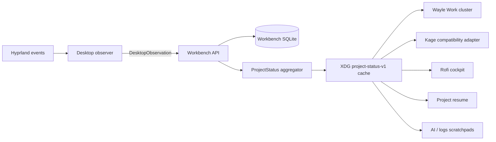

# AI Workbench desktop integration

The TypeScript AI Workbench is the canonical owner of project selection, active context, active work, checks, services and runtime state. Dotfiles observes Hyprland and presents cached state; it does not create a second durable registry.

## Current flow



The observer refreshes status after the resolved project changes or the cache expires. Wayle only reads the compact cache every five seconds; it does not run Git, Docker, model, or network probes.

## Wayle Work cluster

The right side of the bar contains one grouped cluster:

```text
[Project] [Git/Checks] [Work] [AI]
```

- Project shows selection, pin, confidence and stale state. Left click opens the project cockpit; right click switches the canonical Workbench selection.
- Git shows branch, changed/staged counts and conflicts.
- Work shows the active task, state and progress.
- AI shows the model role and normalized runtime state. Unknown is shown honestly until model supervision is connected.

Workbench launch actions use project-aware deep links: project overview, Work, Ask, Planner, and Checks inherit the cached canonical project ID.

All four chips are rendered by `hypr/scripts/workbench-wayle-status`. Tooltips are human text, not raw JSON. Offline fallback is read-only and visibly stale/unavailable.

## Desktop commands

```bash
kage project current --wayle
kage project current --json
kage project status
kage project refresh
workbench-wayle-status project
workbench-wayle-status git
workbench-wayle-status work
workbench-wayle-status ai
workbench-project-switcher
```

`kage project refresh` prefers the Workbench status API and falls back to the legacy detector only when Workbench is unavailable. The old Kage cache remains for rollback during migration.

The project switcher fails closed if Workbench is offline. It never writes a local selection; it sends the chosen registered project ID to `/context/selection` and then refreshes the compact cache.

## Scratchpads and resume

Project resume, AI helper context, and AI/log scratchpad launch now prefer the canonical cached project path. New scratchpad processes receive `AI_WORKBENCH_PROJECT_ID`, `AI_WORKBENCH_PROJECT_NAME`, `AI_WORKBENCH_TASK_ID`, `AI_WORKBENCH_RUN_ID`, and `AI_WORKBENCH_SESSION_ID` alongside the path. Their terminal title shows the visible project identity. Explicit `NOXFLOW_AI_CONTEXT` and `NOXFLOW_SCRATCH_PIN_PROJECT_PATH` remain supported.

An existing interactive scratchpad is preserved when project focus changes. The manager notifies that it remains pinned instead of destroying unsaved terminal work. Close and reopen a pad to follow the current project, or set `NOXFLOW_SCRATCH_PIN_PROJECT_PATH` for an intentional persistent pin.

## Offline behavior

When Workbench is unavailable:

- Wayle returns valid JSON payloads with an unavailable/stale tooltip.
- Project and Git chips may use the existing legacy Kage cache.
- Canonical project selection and other mutations fail clearly.
- Kage’s old detector remains a rollback fallback.
- Terminals, scratchpads and project resume continue to launch.

## Validation

```bash
bash -n hypr/scripts/ai-workbench-observer hypr/scripts/kage \
  hypr/scripts/workbench-wayle-status hypr/scripts/workbench-project-switcher \
  hypr/scripts/kage-project-rofi.sh hypr/scripts/project-resume.sh \
  hypr/scripts/scratchpad-manager.sh hypr/scripts/ai-helper-context.sh

shellcheck hypr/scripts/ai-workbench-observer hypr/scripts/kage \
  hypr/scripts/workbench-wayle-status hypr/scripts/workbench-project-switcher \
  hypr/scripts/kage-project-rofi.sh hypr/scripts/project-resume.sh

python3 -c 'import tomllib; tomllib.load(open("wayle/config.toml", "rb"))'
wayle config schema >/dev/null
./setup/test-workbench-desktop.sh
```

`setup/check-local.sh` currently also reports pre-existing shfmt differences across many unrelated scripts. The Workbench scripts are validated directly so that legacy formatting is not rewritten as part of this migration.

## Remaining Phase 5 compatibility work

- Route canonical recommended actions through the Workbench workflow policy instead of legacy Kage shell cases.
- Replace project-specific tmux scene conventions with approved manifest scene templates.
- Add an event/file watcher bridge for faster Git-to-cache refresh without frequent polling.
- Retire the old Kage watcher only after manual desktop parity and rollback validation.
