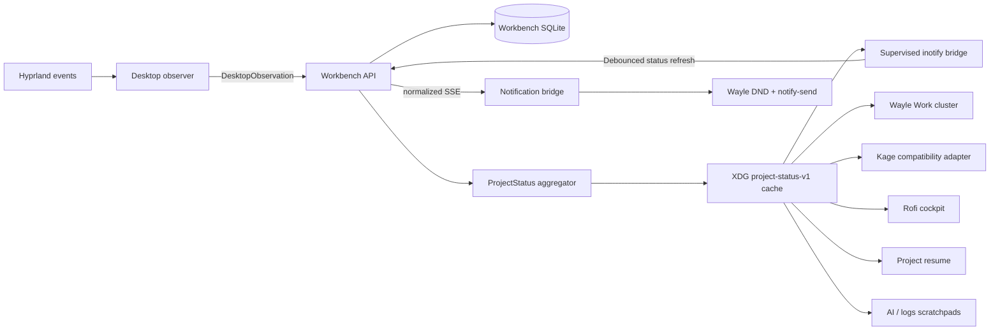

# AI Workbench desktop integration

The TypeScript AI Workbench is the canonical owner of project selection, active context, active work, checks, services and runtime state. Dotfiles observes Hyprland and presents cached state; it does not create a second durable registry.

## Current flow



The observer refreshes status after the resolved project changes or the cache expires. Its supervised sibling project
watcher reads the canonical cached project path, subscribes to Linux inotify events, excludes dependency/build/index
trees, and coalesces meaningful changes before requesting one project-scoped status refresh. The watcher never runs
Git, Docker, project detection, or canonical mutations. Wayle only reads the compact cache every five seconds.

For focused VS Code or VSCodium windows, the observer may publish a workspace-only editor hint. It accepts the
workspace label only when it is an exact, unique match for a name, alias, or path basename in the canonical
read-only registry cache. It does not infer an active file, accept an ambiguous label, or treat the editor process
CWD as evidence. Unregistered, malformed, single-file, and ambiguous titles remain unresolved for Workbench to
explain or for the user to pin explicitly.

## Wayle Work cluster

The right side of the bar contains one grouped cluster:

```text
[Project] [Git/Checks] [Work] [AI]
```

- Project shows selection, pin, confidence and stale state. Left click opens the project cockpit; right click switches the canonical Workbench selection.
- Git shows branch, changed/staged counts and conflicts.
- Work shows the active task, state and progress.
- AI shows the model role and canonical model-manager state. Optional local runtime failure renders offline without
  making the project control plane unavailable.

Workbench launch actions use project-aware deep links: project overview, Work, Ask, Planner, and Checks inherit the cached canonical project ID.
The Rofi cockpit also exposes `Explain retrieval context`, which opens the active project’s retrieval explanation
surface. Handoff, Dev, and Retrieval are supported project-aware launcher views rather than generic root-page links.

All four chips are rendered by `hypr/scripts/workbench-wayle-status`. Tooltips are human text, not raw JSON. Offline fallback is read-only and visibly stale/unavailable.

## Add a Wayle status or action

1. Add the durable field or state transition to a versioned Workbench contract first. Do not invent a desktop-only
   task, project, runtime, or workflow field.
2. Project the smallest presentation value through canonical `ProjectStatus`/`compactProjectStatus`, add TypeScript
   validation and aggregation tests, and keep secrets, commands, prompts, and memory bodies out of the cache.
3. Extend `workbench-wayle-status` to read only `.compact`. Always emit valid one-line JSON, a short text label, and a
   human tooltip for ready, stale, offline, failed, and missing-field states. Never add Git, Docker, port, or network
   probes to the Wayle command.
4. Add or update the grouped modules in `wayle/config.toml`. Reuse the stable Project/Git/Work/AI vocabulary, respect
   reduced motion, and keep the five-second file read inexpensive.
5. Route actions through `kage-project-rofi.sh`, `workbench-project-switcher`, or another canonical API client. List
   approved `/actions` and disabled reasons; never copy a manifest command into a shell `case`, and never bypass an
   approval because an action originated from the bar.
6. Add fixtures to `setup/test-workbench-desktop.sh`, exercise offline and stale caches, run `setup/check-local.sh`,
   and verify the rendered chip/cockpit manually in Wayle.

New deep links must derive project/task/run/session IDs from the canonical cache and use `open-ai-workbench.sh`; a
generic in-memory browser selection is not sufficient.

## Desktop commands

```bash
kage project current --wayle
kage project current --json
kage project status
kage project refresh
workbench-wayle-status project
workbench-wayle-status git
workbench-wayle-status work
workbench-wayle-status ai
workbench-project-switcher
```

`kage project refresh` prefers the Workbench status API and falls back to the legacy detector only when Workbench is unavailable. The old Kage cache remains for rollback during migration.

The project switcher fails closed if Workbench is offline. It never writes a local selection; it sends the chosen registered project ID to `/context/selection` and then refreshes the compact cache.

## Runtime configuration and startup

Workbench-aware desktop scripts read `~/.config/ai-workbench/runtime.env`, the same central configuration consumed by the Workbench systemd user units. `workbench-runtime-env.sh` supplies local-first defaults when the file is absent. Kage, the observer, Rofi switcher, Workbench launcher, and AI context helpers no longer need separate Workbench/model port ownership.

Runtime precedence is explicit process environment, then the shared `runtime.env`, then local defaults. This permits a
one-command diagnostic or isolated test instance without the user environment file silently redirecting the client
to another API or web port.

The supervised workflow PATH includes `~/.local/bin`. Bootstrap installs a small `pnpm` bridge there so structured
manifest workflows can use the project-native package manager without embedding an NVM version path. The bridge
uses the nearest `.nvmrc`, then `AI_WORKBENCH_NODE_VERSION` from central runtime configuration, and finally `lts/*`.
It fails clearly when NVM's `nvm-exec` is unavailable and does not source an interactive shell.

`open-ai-workbench.sh` probes the core `/ready` endpoint and starts `ai-workbench.target` when the user units are installed. If systemd startup is unavailable or fails, it preserves the existing `ai-workbench` tmux fallback. Optional model and vector services do not prevent the project control plane from opening.

The desktop observer, project watcher and notification bridge units read the central environment file. Bootstrap links
the units but does not enable or start them. For a narrow install that does not touch unrelated dotfiles, use
`setup/install-workbench-desktop-services.sh install --enable`; its `uninstall` action stops and removes only these
three units while preserving caches and runtime configuration. Full install/start and rollback procedures remain
explicit in the AI repository's `docs/RUNTIME_SUPERVISION.md`.

The `ai-workbench-notification-bridge` graphical-session service consumes the canonical SSE stream and keeps only a private XDG reconnect cursor. It notifies for approvals, run/check failures, run completion, manually requested indexing, blocked work and runtime loss. Routine focus, retrieval and model-call events are ignored. Wayle DND and `AI_WORKBENCH_NOTIFICATIONS_ENABLED=false` suppress display without losing the event cursor. Notification actions open canonical Workbench deep links when supported.

## Interactive workflow secrets

Terminal and tmux workflows use `workbench-workflow-launch.py`. The API-authorized capability contains the structured
command, canonical context identifiers, and approved secret names, but never their values. Configure the same private
provider path used by Workbench in `~/.config/ai-workbench/runtime.env`:

```bash
AI_WORKBENCH_SECRET_FILE=/home/namik/.config/ai-workbench/workflow-secrets.env
```

The provider uses `NAME=value` entries and must be an absolute, canonical regular file owned by the current user with
mode 0600 or stricter. The launcher rejects symlinks, resolves only names approved by both the project manifest and
command, deletes its one-use capability before starting the child, and never adds values to API calls, logs, caches,
SQLite, command arguments, or the capability file. The child receives a reduced ambient environment plus canonical
Workbench identifiers and the explicitly requested values.

## Scratchpads and resume

Project resume, AI helper context, and AI, runner/log, and database scratchpad launch now prefer the canonical cached
project path. New contextual scratchpad processes receive `AI_WORKBENCH_PROJECT_ID`, `AI_WORKBENCH_PROJECT_PATH`,
`AI_WORKBENCH_PROJECT_NAME`, `AI_WORKBENCH_TASK_ID`, `AI_WORKBENCH_RUN_ID`, and `AI_WORKBENCH_SESSION_ID`. Their
terminal title shows the visible project identity, and the database pad starts in the same canonical project without
copying database credentials into the desktop cache. Explicit `NOXFLOW_AI_CONTEXT`, `NOXFLOW_DB_CONTEXT`, and
`NOXFLOW_SCRATCH_PIN_PROJECT_PATH` remain supported.

The standalone AI helper exports the same project, session, task and run identifiers before launching Codex.
OpenCode inherits them through the AI scratchpad shell. Missing or stale cache data remains read-only fallback; these
clients never create a second session store.

`ai-helper-context.sh` reads project, Git, active-file, task/run/session, model and freshness fields only from the
versioned Workbench status cache. It does not probe Git, infer a framework, invoke the legacy focus detector, or read
Kage's project cache. If no canonical project is available, it labels the selected working directory as an offline
directory-only fallback and deliberately leaves repository state unknown. The enhanced local chat uses the same
builder and applies the same conservative fallback if the builder is unavailable.

`project-resume restore` resolves the cached active project or registry selection through `project-profile desktop`,
resumes a matching resumable Workbench session through `/sessions/:id/resume`, and launches the manifest-selected
editor and tmux session. It then restores only allowlisted manifest scratchpads with the same project/task/run/session
launch envelope. An explicit project can never inherit active-work IDs from a different cached project. Manifest
`desktop.scene` continues to identify a canonical development workflow (`project-profile dev`); the resume adapter
does not translate it into shell-owned pane commands.

When no registered project resolves, `project-resume` may open an editor and tmux rooted at the focused directory or
an explicit `--fallback-path`. That fallback performs no Workbench mutation, carries no invented task/session IDs,
and does not execute manifest or legacy project commands.

An existing interactive scratchpad is preserved when project focus changes. The manager notifies that it remains pinned instead of destroying unsaved terminal work. Close and reopen a pad to follow the current project, or set `NOXFLOW_SCRATCH_PIN_PROJECT_PATH` for an intentional persistent pin.

## Offline behavior

When Workbench is unavailable:

- Wayle returns valid JSON payloads with an unavailable/stale tooltip.
- Project and Git chips may use the existing legacy Kage cache.
- Canonical project selection and other mutations fail clearly.
- The Rofi cockpit may show legacy identity/status for rollback, but it never lists or executes legacy cached project
  commands. Development and check actions require the canonical workflow API.
- Kage’s old detector remains a rollback fallback.
- Terminals, scratchpads and project resume continue to launch.

## Validation

```bash
bash -n hypr/scripts/ai-workbench-observer hypr/scripts/kage \
  hypr/scripts/workbench-runtime-env.sh hypr/scripts/open-ai-workbench.sh \
  hypr/scripts/workbench-wayle-status hypr/scripts/workbench-project-switcher \
  hypr/scripts/kage-project-rofi.sh hypr/scripts/project-resume.sh \
  hypr/scripts/scratchpad-manager.sh hypr/scripts/ai-helper-context.sh

shellcheck hypr/scripts/ai-workbench-observer hypr/scripts/kage \
  hypr/scripts/workbench-runtime-env.sh hypr/scripts/open-ai-workbench.sh \
  hypr/scripts/workbench-wayle-status hypr/scripts/workbench-project-switcher \
  hypr/scripts/kage-project-rofi.sh hypr/scripts/project-resume.sh

python3 -c 'import tomllib; tomllib.load(open("wayle/config.toml", "rb"))'
wayle config schema >/dev/null
./setup/test-workbench-desktop.sh
./setup/test-workbench-desktop-services.sh
./setup/test-ai-helper-context.sh
./setup/test-project-resume.sh
./setup/test-project-profile.sh
python3 -m unittest setup/test-workbench-project-watch.py
python3 setup/test-workbench-notification-bridge.py
python3 -m unittest setup/test-workbench-workflow-launch.py
```

`setup/check-local.sh` validates the complete shell tree, stale-reference guardrails, keybind documentation and
Hyprland configuration. The focused adapter tests then exercise canonical project/profile actions and Python bridges.

### Live focus validation — 2026-07-20

With the supervised API, worker, observer, project watcher, and notification bridge active, focusing the registered
AI Workbench VS Code window produced a workspace-only editor observation for `/home/namik/Documents/code/ai`.
Workbench selected that project through `focused_editor` at confidence `0.96` and rejected the shared Code process
CWD pointing at Dotfiles as lower-precedence evidence. Restoring the original Kitty window selected Dotfiles through
`focused_terminal` at confidence `0.92`. The test restored the original window and did not pin either project.

A disposable Kitty client attached to a disposable tmux session then proved positive process-tree correlation. The
observation included the exact client PID, session, pane ID, pane CWD, and `associationVerified: true`; Workbench used
the correlated `/home/namik/Documents/code/ai` pane CWD for focused-terminal resolution and rejected Kitty's stale
launcher CWD. This rehearsal exposed and fixed a literal `\\t` delimiter bug in both tmux client and pane parsing.
The fixture window and session were removed after restoring the original terminal.

The AI Workbench repository was onboarded through register, dry-run diff, pending proposal, explicit approval, and
export verification. Its canonical manifest owns the `ai`, `workbench`, and `ai-workbench` aliases, structured
read-only lint/typecheck/test workflows, retrieval roots, and desktop projection. A consistent SQLite backup was
validated before onboarding.

All three synchronized manifest workflows were then exercised through the canonical action API. The first lint
attempt failed closed and persisted `spawn pnpm ENOENT`, exposing that the reduced systemd PATH could not reach the
NVM package manager. After installing the tested `~/.local/bin/pnpm` bridge, lint completed in 713 ms, typecheck in
3.66 seconds, and the local-first test workflow completed 377/377 tests in 35.5 seconds. Each execution retained its
structured command, exit status, timestamps, output, and audit history; no approval was bypassed.

Focusing the AI editor after those runs projected `completed` with three passed checks into `ProjectStatus` and the
compact cache. The real Wayle adapters rendered AI Workbench at 96% editor confidence, clean `main`, no active task,
and the explicitly offline optional AI runtime; restoring Kitty regenerated the cache for Dotfiles at 92% terminal
confidence.

## Remaining Phase 5 compatibility work

- Completed: `project-profile` resolves projects and tmux session names from the canonical registry cache, and routes
  development/check commands through approved Workbench actions. No project paths, commands or pane topology remain
  hard-coded in the adapter. Detailed multi-pane scenes can be added later as approved manifest workflow DAGs.
- Completed: the separately supervised project watcher owns an inotify-based, dependency-pruned and debounced event
  bridge that requests
  canonical status refreshes without running desktop-side Git or Docker probes.
- Retire the old Kage watcher only after manual desktop parity and rollback validation.
