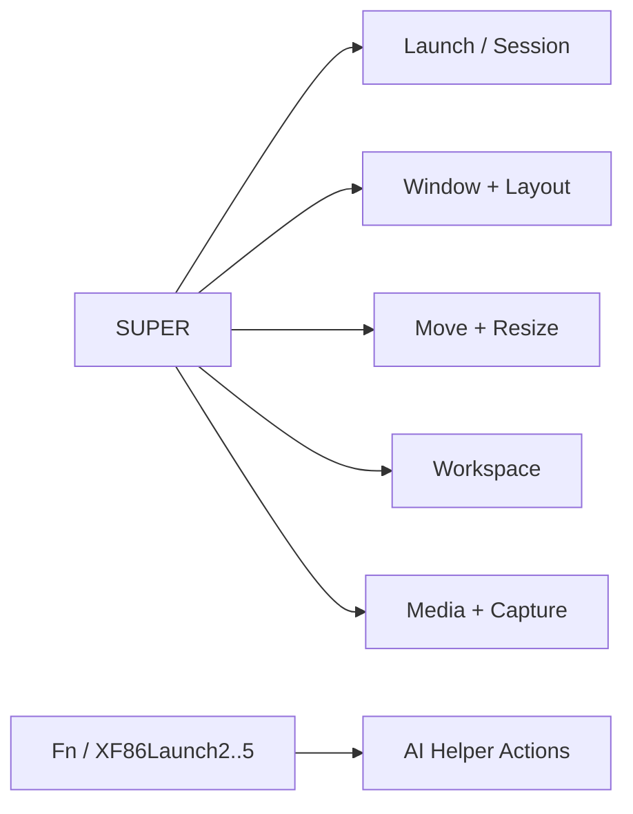
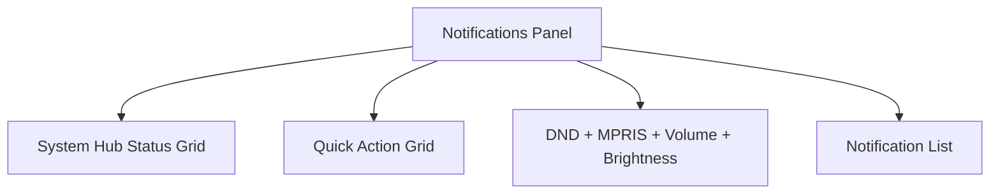

# Hyprland Keybinds

This is the canonical keybind map for the repo.

## Map Overview

## Launch / Session

| Keybind | Action | Script/Target |
|---|---|---|
| `Super + Return` | Open terminal | `kitty` |
| `Super + E` | Open file manager | `dolphin` |
| `Super + Space` | Ultra-fast app launcher (press again to close) | `launcher.sh --fast` |
| `Super + Shift + Space` | Window/workspace search | `workspace-overview.sh` |
| `Super + Ctrl + Space` | Command palette (quick actions) | `quick-actions.sh` |
| `Super + .` | Fullscreen dev cheatsheet overlay (searchable tabs) | `dev-cheatsheet.sh` |
| `Super + F1` | Keybind cheat sheet overlay | `hypr-binds.sh` |
| `Super + A` or `Super + /` | Quick actions (press again to close) | `quick-actions.sh` |
| `Super + Ctrl + /` | Keybind cheat sheet overlay | `hypr-binds.sh` |
| `Super + Y` | Workspace hub (primary path) | `workspace-overview-toggle.sh` |
| `Super + W` | Workspace overview (direct Rofi path) | `workspace-overview.sh` |
| `Super + Tab` | Overview toggle (`hyprexpo` if available, Rofi fallback) | `workspace-overview-toggle.sh` |
| `Super + Shift + Tab` | Fallback overview | `workspace-overview.sh` |
| `Super + B` | Open browser | `google-chrome-stable` |
| `Super + \` | Toggle side panel special workspace | `sidepanel.sh toggle` |
| `Super + Shift + \` | Move active window to side panel and open it | `sidepanel.sh send` |
| `Super + Ctrl + \` | Stash active window into side panel | `sidepanel.sh stash` |
| `Super + N` | Toggle notification panel | `swaync-client -t` |
| `Super + Alt + N` | Toggle DND | `swaync-client -d` |
| `Super + Ctrl + N` | Copy notification/status summary | `notification-summary.sh copy` |
| `Super + Shift + N` | Open notes folder | `open-notes.sh` |
| `Super + Alt + E` | Open notes folder | `open-notes.sh` |
| `Super + D` | Quick actions menu (duplicate launcher utility key) | `quick-actions.sh` |
| `Super + ,` | Open Settings Hub | `settings-hub.sh` |
| `Super + Shift + ,` | Re-apply last selected settings section | `settings-hub.sh last` |
| `Super + Ctrl + ,` | Quick settings toggle (notification sounds) | `settings-hub.sh quick` |
| `Super + Alt + ,` | Toggle Eww detailed settings panel | `settings-eww.sh` |
| `Super + Ctrl + Alt + ,` | Apply per-app routing to focused app | `app-routing-apply-focused.sh` |
| `Super + Ctrl + Y` | Restore Waybar panel | `panel-switch.sh waybar` |
| `Super + Alt + Y` | Toggle panel visibility (view only) | `panel-switch.sh toggle-view` |
| `Super + Ctrl + Shift + Y` | Toggle desktop widgets (behind windows) | `eww-desktop-toggle.sh` |
| `Super + Escape` | Power menu | `power-menu.sh` |
| `Super + Ctrl + L` | Lock screen | `lock.sh` |

## Window / Layout

| Keybind | Action |
|---|---|
| `Super + F` | Toggle floating |
| `Super + M` | Maximize / unmaximize (fullscreen mode 1) |
| `Super + Shift + F` | Fullscreen (mode 1) |
| `Super + Ctrl + F` | Fullscreen (mode 0) |
| `Super + G` | Toggle `dwindle` / `master` |
| `Super + Alt + G` | Cycle dynamic layout (`dwindle -> master -> allfloat -> allpseudo`) |
| `Super + Shift + G` | Toggle floating-grid |
| `Super + Ctrl + G` | Force `master` |
| `Super + Ctrl + Shift + G` | Force `dwindle` |
| `Super + T` | Toggle window group (tab-like stack) |
| `Super + Ctrl + T` | Move active window out of group |
| `Super + Alt + ;` / `Super + Alt + .` | Prev/next tab in group |

## Focus / Move / Resize

| Keybind | Action |
|---|---|
| `Super + H/J/K/L` or arrows | Move focus |
| `Alt + Tab` / `Alt + Shift + Tab` | Cycle windows in current workspace |
| `Super + Shift + H/J/K/L` or arrows | Move window |
| `Super + Ctrl + H/J/K/L` or arrows | Move floating window |
| `Super + Ctrl + Shift + H/J/K/L` or arrows | Resize floating window |

## Workspace

| Keybind | Action |
|---|---|
| `Super + 1..0` | Jump to workspace 1..10 |
| `Super + Shift + 1..0` | Move active window to workspace |
| `Super + Ctrl + 0` | Open/focus telemetry dashboard on workspace 10 (`0` key slot) |
| `Super + Ctrl + Shift + 0` | Reset telemetry dashboard session and reopen it |
| `Super + Ctrl + 9` | Open logs workspace launcher (workspace 9) |
| `Super + Ctrl + Shift + 9` | Open logs workspace stack (journal + waybar logs) |
| `Super + [` / `Super + ]` | Prev / next workspace |
| `Super + mouse wheel` | Prev / next workspace |

## Media / Screen / Clipboard

| Keybind | Action |
|---|---|
| `Super + Ctrl + V` | Clipboard history picker |
| `Super + Shift + S` | Screenshot area |
| `Super + Ctrl + Shift + S` | Screenshot full |
| `Super + Shift + T` | OCR selected area -> clipboard |
| `Super + Ctrl + R` | Toggle screen recording |
| `Super + I` | Color picker |
| `Super + Shift + I` | Night light toggle |
| `XF86Audio*` keys | Volume/media controls |
| `XF86MonBrightness*` keys | Brightness controls |

## AI Helper

| Keybind | Action | Mode |
|---|---|---|
| `Fn + 2` / `XF86Launch2` | Ask AI | `ask` |
| `Fn + 3` / `XF86Launch3` | Summarize clipboard | `clip` |
| `Fn + 4` / `XF86Launch4` | Generate shell command | `shell` |
| `Fn + 5` / `XF86Launch5` | Debug clipboard error | `debug` |
| `Super + Alt + 2..5` | Fallback AI binds | same modes |

## Shell UX

| Key | Action |
|---|---|
| `Ctrl + R` | Atuin history picker |
| `Alt + C` | Fuzzy zoxide jump |
| `Esc` | Enter `zsh-vi-mode` normal mode |

## Tmux Keymaps

| Keybind | Action |
|---|---|
| `Ctrl + A` | Tmux prefix |
| `Prefix + c` | New window (current directory) |
| `Prefix + -` / `Prefix + \|` | Split horizontal / vertical |
| `Prefix + h/j/k/l` | Focus pane left/down/up/right |
| `Prefix + H/J/K/L` | Resize pane |
| `Prefix + [` | Enter copy mode (vi) |
| `copy-mode: v` then `y` | Select and copy to clipboard (`wl-copy`) |
| `Prefix + r` | Reload `~/.tmux.conf` |

## Kitty Terminal Keymaps

| Keybind | Action |
|---|---|
| `Ctrl + Shift + T` | New tab (inherits current working directory) |
| `Ctrl + Shift + Q` | Close current tab |
| `Ctrl + Shift + W` | Close current split/window |
| `Ctrl + Shift + [` / `Ctrl + Shift + ]` | Previous / next tab |
| `Ctrl + Shift + Enter` | New terminal window (same cwd) |
| `Ctrl + Shift + O` / `Ctrl + Shift + E` | Split horizontal / vertical |
| `Ctrl + Shift + H/J/K/L` | Focus left/down/up/right split |
| `Ctrl + Shift + Alt + H/J/K/L` | Resize split (narrow/short/tall/wide) |
| `Ctrl + Shift + F5` | Reload kitty config |
| Select text | Auto-copy to clipboard (`copy_on_select`) |

## Rofi Menus (Launcher + Quick Actions)

| Key | Action |
|---|---|
| `Ctrl + 1..0` | Quick-select row 1..10 |
| `Enter` | Run/open selected item |
| `Esc` or opener key again | Close menu (`Super+Space` / `Super+A`) |

## Workspace Hub In-Menu Hotkeys

| Key | Action |
|---|---|
| `Ctrl + Alt + R` | Rename selected workspace |
| `Ctrl + Alt + Backspace` | Clear selected workspace label |
| `Ctrl + Alt + F` | Toggle selected workspace favorite |
| `Ctrl + Alt + S` | Show overview shortcuts panel |
| `Ctrl + Alt + M` | Move selected window to workspace |
| `Ctrl + Alt + O` | Move selected window + follow |
| `Ctrl + Alt + P` | Send selected window to side panel |

## Notification Panel Contents

| Section | What it shows |
|---|---|
| Status grid | GPU active, media active, network online, panel visible |
| Actions grid | Clear all, copy status, DND toggle, desktop widgets toggle, net applet, panel view, restart bar |
| Controls | DND widget, media (MPRIS), volume slider, brightness slider |
