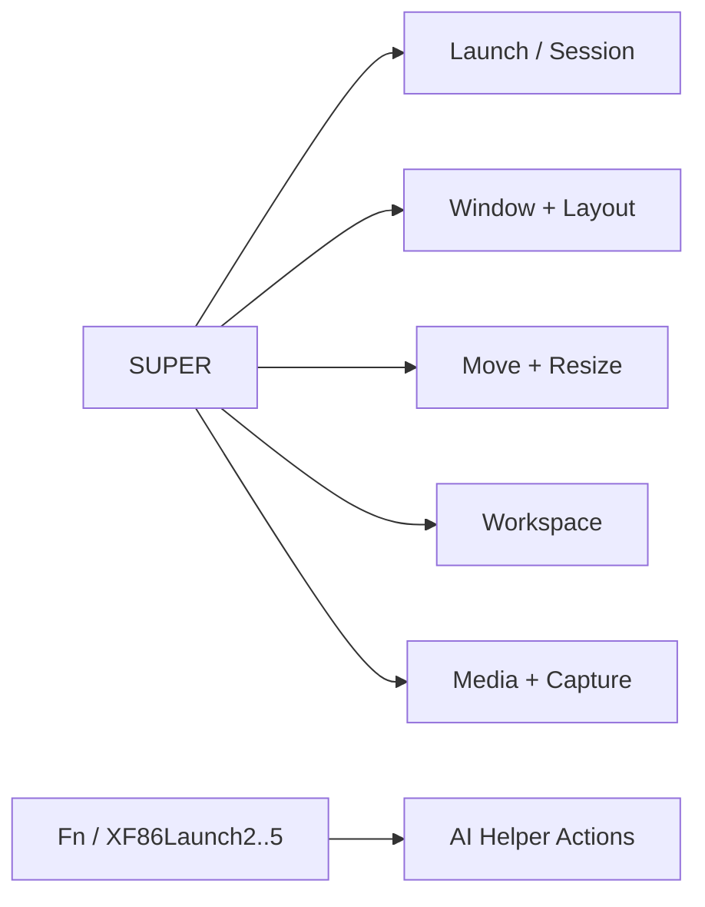

# Hyprland Keybinds

This is the canonical keybind map for the repo.

## Map Overview

## Launch / Session

| Keybind | Action | Script/Target |
|---|---|---|
| `Super + Return` | Open terminal | `kitty` |
| `Super + E` | Open file manager | `dolphin` |
| `Super + Space` | App launcher | `~/.config/hypr/scripts/launcher.sh` |
| `Super + A` or `Super + /` | Quick actions menu | `quick-actions.sh` |
| `Super + W` | Workspace overview (Rofi) | `workspace-overview.sh` |
| `Super + Tab` | Mission control overview | `hyprexpo:expo toggle` |
| `Super + Shift + Tab` | Fallback overview | `workspace-overview.sh` |
| `Super + B` | Open browser | `google-chrome-stable` |
| `Super + D` | Toggle dock | `dock-toggle.sh` |
| `Super + Y` | Toggle Eww panel | `eww-toggle.sh` |
| `Super + Ctrl + Y` | Toggle Waybar/HyprPanel | `panel-switch.sh toggle` |
| `Super + Escape` | Power menu | `power-menu.sh` |
| `Super + L` | Lock screen | `lock.sh` |

## Window / Layout

| Keybind | Action |
|---|---|
| `Super + F` | Toggle floating |
| `Super + Shift + F` | Fullscreen (mode 1) |
| `Super + Ctrl + F` | Fullscreen (mode 0) |
| `Super + G` | Toggle `dwindle` / `master` |
| `Super + Shift + G` | Toggle floating-grid |
| `Super + Ctrl + G` | Force `master` |
| `Super + Ctrl + Shift + G` | Force `dwindle` |
| `Super + T` | Toggle window group (tab-like stack) |
| `Super + ,` / `Super + .` | Prev/next tab in group |

## Focus / Move / Resize

| Keybind | Action |
|---|---|
| `Super + H/J/K/L` or arrows | Move focus |
| `Super + Shift + H/J/K/L` or arrows | Move window |
| `Super + Ctrl + H/J/K/L` or arrows | Move floating window |
| `Super + Ctrl + Shift + H/J/K/L` or arrows | Resize floating window |

## Workspace

| Keybind | Action |
|---|---|
| `Super + 1..0` | Jump to workspace 1..10 |
| `Super + Shift + 1..0` | Move active window to workspace |
| `Super + [` / `Super + ]` | Prev / next workspace |
| `Super + mouse wheel` | Prev / next workspace |
| `Super + grave` | Toggle scratchpad workspace |

## Media / Screen / Clipboard

| Keybind | Action |
|---|---|
| `Super + Ctrl + V` | Clipboard history picker |
| `Super + Shift + S` | Screenshot area |
| `Super + Ctrl + Shift + S` | Screenshot full |
| `Super + Ctrl + R` | Toggle screen recording |
| `Super + I` | Color picker |
| `Super + Shift + I` | Night light toggle |
| `XF86Audio*` keys | Volume/media controls |
| `XF86MonBrightness*` keys | Brightness controls |

## AI Helper

| Keybind | Action | Mode |
|---|---|---|
| `Fn + 2` / `XF86Launch2` | Ask AI | `ask` |
| `Fn + 3` / `XF86Launch3` | Summarize clipboard | `clip` |
| `Fn + 4` / `XF86Launch4` | Generate shell command | `shell` |
| `Fn + 5` / `XF86Launch5` | Debug clipboard error | `debug` |
| `Super + Alt + 2..5` | Fallback AI binds | same modes |

## Shell UX

| Key | Action |
|---|---|
| `Ctrl + R` | Atuin history picker |
| `Alt + C` | Fuzzy zoxide jump |
| `Esc` | Enter `zsh-vi-mode` normal mode |
