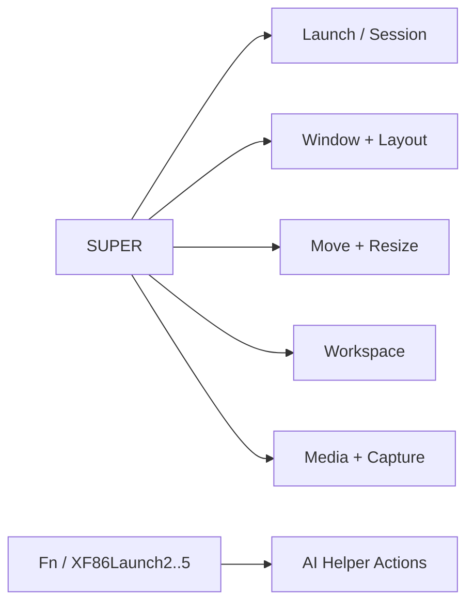
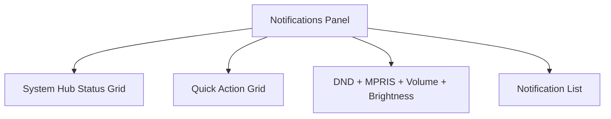

# Hyprland Keybinds

This is the canonical keybind map for the repo.

## Map Overview

```mermaid
flowchart LR
  SUPER[SUPER] --> Launch[Launch / Session]
  SUPER --> Window[Window + Layout]
  SUPER --> Move[Move + Resize]
  SUPER --> WS[Workspace]
  SUPER --> Media[Media + Capture]
  FN[Fn / XF86Launch2..5] --> AI[AI Helper Actions]
```

<!-- BEGIN GENERATED HYPRLAND KEYBINDS -->

<!-- Generated by setup/generate-keybind-docs.py; do not edit this section manually. -->

## Launch / Session

| Keybind | Action | Script/Target |
|---|---|---|
| `Super + Return` | Execute command | `kitty` |
| `Super + Space` | Execute command | `~/.local/bin/noxctl panel toggle launcher` |
| `Super + C` | Execute command | `~/.local/bin/noxctl panel toggle control` |
| `Super + N` | Execute command | `~/.local/bin/noxctl panel toggle notifications` |
| `Super + M` | Execute command | `~/.local/bin/noxctl panel toggle media` |
| `Super + V` | Execute command | `~/.local/bin/noxctl panel toggle clipboard` |
| `Super + S` | Execute command | `~/.local/bin/noxctl panel toggle share` |
| `Super + W` | Execute command | `~/.config/hypr/scripts/set-wallpaper.sh --pick` |
| `Super + Shift + S` | Execute command | `~/.local/bin/noxctl panel toggle capture` |
| `Super + ,` | Execute command | `~/.local/bin/noxctl panel toggle settings` |
| `Super + D` | Execute command | `~/.local/bin/noxctl panel toggle dashboard` |
| `Super + Shift + C` | Execute command | `~/.local/bin/noxctl panel toggle calendar` |
| `Super + Shift + B` | Execute command | `~/.local/bin/noxctl panel toggle control` |
| `Super + Ctrl + Shift + Y` | Execute command | `~/.config/hypr/scripts/theme-pass.sh` |
| `Super + Shift + ,` | Execute command | `~/.config/hypr/scripts/settings-hub.sh` |
| `Super + Alt + M` | Execute command | `~/.config/hypr/scripts/minimize-window.sh restore` |
| `Super + Ctrl + ,` | Execute command | `~/.config/hypr/scripts/settings-hub.sh quick` |
| `Super + Alt + ,` | Execute command | `~/.config/hypr/scripts/settings/editor.sh` |
| `Super + Ctrl + Alt + ,` | Execute command | `~/.config/hypr/scripts/app-routing-apply-focused.sh` |
| `Super + E` | Execute command | `kitty --class yazi -e yazi` |
| `Super + B` | Execute command | `google-chrome-stable --ozone-platform-hint=auto` |
| `Super + I` | Execute command | `code` |
| `Super + Ctrl + Shift + I` | Execute command | `android-studio` |
| `Super + Ctrl + I` | Execute command | `~/.config/hypr/scripts/android-dev.sh menu` |
| `Super + Alt + I` | Execute command | `~/.config/hypr/scripts/android-dev.sh logcat` |
| `Super + Alt + S` | Execute command | `~/.config/hypr/scripts/open-ai-workbench.sh` |
| `Super + G` | Execute command | `~/.config/hypr/scripts/layout-switcher.sh cycle` |
| `Super + Alt + G` | Execute command | `~/.config/hypr/scripts/layout-switcher.sh toggle` |
| `Super + P` | Execute command | `~/.config/hypr/scripts/monitor-control.sh menu` |
| `Super + H` | Execute command | `~/.local/bin/hypr-phone menu` |
| `Super + Shift + H` | Execute command | `~/.local/bin/hypr-phone mirror --profile default` |
| `Super + Ctrl + H` | Execute command | `~/.config/hypr/scripts/syncthing-control.sh open-ui` |
| `Super + Alt + H` | Hyprland action | `workspace.toggle_special phone` |
| `Super + Escape` | Execute command | `~/.config/hypr/scripts/power-menu.sh` |
| `Super + Ctrl + L` | Execute command | `~/.config/hypr/scripts/lock.sh` |
| `Super + Ctrl + Alt + L` | Execute command | `~/.config/hypr/scripts/screensaver-awake.sh` |
| `Super + \` | Execute command | `~/.config/hypr/scripts/scratchpad-manager.sh menu` |
| `Super + Shift + \` | Execute command | `~/.config/hypr/scripts/scratchpad-manager.sh toggle scene` |
| `Super + Alt + \` | Execute command | `~/.config/hypr/scripts/scratchpad-manager.sh launch ai` |
| `Super + Ctrl + \` | Execute command | `~/.config/hypr/scripts/scratchpad-manager.sh launch logs` |
| `Super + Ctrl + Alt + \` | Execute command | `~/.config/hypr/scripts/scratchpad-manager.sh launch db` |
| `Super + `` | Execute command | `~/.config/hypr/scripts/sidepanel.sh toggle` |
| `Super + Shift + `` | Execute command | `~/.config/hypr/scripts/sidepanel.sh send` |
| `Super + Ctrl + `` | Execute command | `~/.config/hypr/scripts/sidepanel.sh stash` |
| `Super + Alt + `` | Execute command | `~/.config/hypr/scripts/sidepanel.sh toggle` |
| `Super + O` | Execute command | `~/.config/hypr/scripts/set-wallpaper.sh --pick` |
| `Super + Shift + O` | Execute command | `~/.config/hypr/scripts/set-wallpaper.sh --next` |
| `Super + Alt + N` | Execute command | `~/.config/hypr/scripts/notif-dnd-toggle.sh` |
| `Super + Shift + N` | Execute command | `~/.config/hypr/scripts/open-notes.sh` |
| `Super + Alt + E` | Execute command | `~/.config/hypr/scripts/open-notes.sh` |
| `Super + Shift + Q` | Close active window | `—` |
| `Super + Shift + M` | Execute command | `~/.config/hypr/scripts/minimize-window.sh minimize` |
| `Super + F` | Execute command | `~/.config/hypr/scripts/float-toggle-smart.sh` |
| `Super + Shift + F` | Toggle fullscreen/maximized | `mode=maximized` |
| `Super + Ctrl + F` | Toggle fullscreen/maximized | `mode=fullscreen` |
| `Super + Shift + P` | Toggle pseudo-tile | `—` |
| `Super + Ctrl + C` | Center active window | `—` |

## Window / Layout

| Keybind | Action | Script/Target |
|---|---|---|
| `Super + J` | Layout action | `togglesplit` |
| `Super + Alt + J` | Layout action | `orientationcycle left top right bottom` |
| `Super + K` | Layout action | `swapsplit` |
| `Super + Ctrl + Return` | Layout action | `swapwithmaster master` |
| `Super + Shift + G` | Execute command | `~/.config/hypr/scripts/layout-switcher.sh allfloat` |
| `Super + Ctrl + G` | Execute command | `~/.config/hypr/scripts/layout-switcher.sh master` |
| `Super + Ctrl + Shift + G` | Execute command | `~/.config/hypr/scripts/layout-switcher.sh dwindle` |
| `Super + Ctrl + Alt + G` | Execute command | `~/.config/hypr/scripts/layout-switcher.sh scroll` |
| `Super + Ctrl + Alt + Shift + G` | Execute command | `~/.config/hypr/scripts/layout-switcher.sh monocle` |
| `Super + Alt + F` | Execute command | `~/.config/hypr/scripts/layout-switcher.sh allfloat` |
| `Super + Ctrl + Alt + P` | Execute command | `~/.config/hypr/scripts/layout-switcher.sh allpseudo` |
| `Super + Ctrl + Alt + left` | Layout action | `mfact -0.04` |
| `Super + Ctrl + Alt + right` | Layout action | `mfact +0.04` |
| `Alt + tab` | Execute command | `hyprctl dispatch cyclenext && hyprctl dispatch bringactivetotop` |
| `Alt + Shift + tab` | Execute command | `hyprctl dispatch cyclenext prev && hyprctl dispatch bringactivetotop` |
| `Super + Ctrl + 0` | Execute command | `~/.config/hypr/scripts/telemetry-workspace.sh open` |
| `Super + Ctrl + Shift + 0` | Execute command | `~/.config/hypr/scripts/telemetry-workspace.sh reset` |
| `Super + Ctrl + 9` | Execute command | `~/.config/hypr/scripts/logs-workspace.sh open` |
| `Super + Ctrl + Shift + 9` | Execute command | `~/.config/hypr/scripts/logs-workspace.sh stack` |
| `Super + T` | Window group action | `toggle` |
| `Super + Alt + .` | Window group action | `next` |
| `Super + Alt + ;` | Window group action | `prev` |
| `Super + .` | Execute command | `~/.config/hypr/scripts/dev-cheatsheet.sh` |

## Focus / Move / Resize

| Keybind | Action | Script/Target |
|---|---|---|
| `Super + left` | Focus window | `direction=left` |
| `Super + right` | Focus window | `direction=right` |
| `Super + up` | Focus window | `direction=up` |
| `Super + down` | Focus window | `direction=down` |
| `Super + Shift + left` | Move active window | `direction=left` |
| `Super + Shift + right` | Move active window | `direction=right` |
| `Super + Shift + up` | Move active window | `direction=up` |
| `Super + Shift + down` | Move active window | `direction=down` |
| `Super + Ctrl + left` | Move active window | `relative=true,x=-80,y=0` |
| `Super + Ctrl + right` | Move active window | `relative=true,x=80,y=0` |
| `Super + Ctrl + up` | Move active window | `relative=true,x=0,y=-80` |
| `Super + Ctrl + down` | Move active window | `relative=true,x=0,y=80` |
| `Super + Ctrl + Shift + left` | Resize active window | `relative=true,x=-80,y=0` |
| `Super + Ctrl + Shift + right` | Resize active window | `relative=true,x=80,y=0` |
| `Super + Ctrl + Shift + up` | Resize active window | `relative=true,x=0,y=-80` |
| `Super + Ctrl + Shift + down` | Resize active window | `relative=true,x=0,y=80` |
| `Super + mouse wheel down` | Focus window | `workspace=e+1` |
| `Super + mouse wheel up` | Focus window | `workspace=e-1` |
| `Super + Ctrl + T` | Move active window | `out_of_group=true` |

## Workspace

| Keybind | Action | Script/Target |
|---|---|---|
| `Super + [` | Focus workspace | `e-1` |
| `Super + ]` | Focus workspace | `e+1` |
| `Super + Shift + [` | Move window to workspace | `e-1` |
| `Super + Shift + ]` | Move window to workspace | `e+1` |
| `Super + 1` | Focus workspace | `1` |
| `Super + Shift + 1` | Move window to workspace | `1` |
| `Super + 2` | Focus workspace | `2` |
| `Super + Shift + 2` | Move window to workspace | `2` |
| `Super + 3` | Focus workspace | `3` |
| `Super + Shift + 3` | Move window to workspace | `3` |
| `Super + 4` | Focus workspace | `4` |
| `Super + Shift + 4` | Move window to workspace | `4` |
| `Super + 5` | Focus workspace | `5` |
| `Super + Shift + 5` | Move window to workspace | `5` |
| `Super + 6` | Focus workspace | `6` |
| `Super + Shift + 6` | Move window to workspace | `6` |
| `Super + 7` | Focus workspace | `7` |
| `Super + Shift + 7` | Move window to workspace | `7` |
| `Super + 8` | Focus workspace | `8` |
| `Super + Shift + 8` | Move window to workspace | `8` |
| `Super + 9` | Focus workspace | `9` |
| `Super + Shift + 9` | Move window to workspace | `9` |
| `Super + 0` | Focus workspace | `10` |
| `Super + Shift + 0` | Move window to workspace | `10` |

## Media / Screen / Clipboard

| Keybind | Action | Script/Target |
|---|---|---|
| `Super + Ctrl + V` | Execute command | `~/.config/hypr/scripts/cliphist-rofi.sh` |
| `Super + Shift + V` | Execute command | `~/.config/hypr/scripts/cliphist-toggle.sh` |
| `Super + Ctrl + Shift + S` | Execute command | `~/.config/hypr/scripts/screenshot.sh full` |
| `Super + Shift + T` | Execute command | `~/.config/hypr/scripts/ocr-capture.sh` |
| `Super + Ctrl + Shift + C` | Execute command | `kage ai commit-msg` |
| `Super + Shift + R` | Execute command | `kage ai review` |
| `Super + Shift + E` | Execute command | `kage ai explain` |
| `Super + Ctrl + R` | Execute command | `~/.config/hypr/scripts/screen-record-toggle.sh` |
| `Super + Alt + P` | Execute command | `hyprpicker -a` |
| `Super + Shift + I` | Execute command | `~/.config/hypr/scripts/night-light-toggle.sh` |
| `XF86Launch2` | Execute command | `~/.config/hypr/scripts/ai-helper.sh ask` |
| `XF86Launch3` | Execute command | `~/.config/hypr/scripts/ai-helper.sh clip` |
| `XF86Launch4` | Execute command | `~/.config/hypr/scripts/ai-helper.sh shell` |
| `XF86Launch5` | Execute command | `~/.config/hypr/scripts/ai-helper.sh debug` |
| `Super + Alt + 2` | Execute command | `~/.config/hypr/scripts/ai-helper.sh raw` |
| `Super + Alt + 3` | Execute command | `~/.config/hypr/scripts/ai-helper.sh clip` |
| `Super + Alt + 4` | Execute command | `~/.config/hypr/scripts/ai-helper.sh shell` |
| `Super + Alt + 5` | Execute command | `~/.config/hypr/scripts/ai-helper.sh debug` |
| `Super + mouse:272` | Drag active window (mouse) | `—` |
| `Super + mouse:273` | Resize active window (mouse) | `window.resize` |
| `XF86AudioRaiseVolume` | Execute command (locked,repeating) | `~/.config/hypr/scripts/volume-control.sh up` |
| `XF86AudioLowerVolume` | Execute command (locked,repeating) | `~/.config/hypr/scripts/volume-control.sh down` |
| `XF86AudioMute` | Execute command (locked,repeating) | `~/.config/hypr/scripts/volume-control.sh mute` |
| `XF86AudioMicMute` | Execute command (locked,repeating) | `~/.config/hypr/scripts/volume-control.sh mic-mute` |
| `XF86MonBrightnessUp` | Execute command (locked,repeating) | `~/.config/hypr/scripts/brightness-control.sh up` |
| `XF86MonBrightnessDown` | Execute command (locked,repeating) | `~/.config/hypr/scripts/brightness-control.sh down` |
| `XF86AudioNext` | Execute command (locked) | `~/.config/hypr/scripts/media-control.sh next` |
| `XF86AudioPause` | Execute command (locked) | `~/.config/hypr/scripts/media-control.sh play-pause` |
| `XF86AudioPlay` | Execute command (locked) | `~/.config/hypr/scripts/media-control.sh play-pause` |
| `XF86AudioPrev` | Execute command (locked) | `~/.config/hypr/scripts/media-control.sh previous` |

<!-- END GENERATED HYPRLAND KEYBINDS -->

## Shell UX

| Key | Action |
|---|---|
| `Ctrl + R` | Atuin history picker |
| `Alt + C` | Fuzzy zoxide jump |
| `Alt + Left` / `Alt + Right` | Move by word in Kitty/zsh |
| `Ctrl + Left` / `Ctrl + Right` | Move by word in Kitty/zsh |
| `Alt + Backspace` | Delete previous word in Kitty/zsh |
| `Esc` | Enter `zsh-vi-mode` normal mode |

## Tmux Keymaps

| Keybind | Action |
|---|---|
| `Ctrl + Space` | Tmux prefix |
| `Prefix + c` | New window (current directory) |
| `Prefix + -` / `Prefix + \|` | Split horizontal / vertical |
| `Prefix + h/j/k/l` | Focus pane left/down/up/right |
| `Prefix + H/J/K/L` | Resize pane |
| `Prefix + [` | Enter copy mode (vi) |
| `copy-mode: v` then `y` | Select and copy to clipboard (`wl-copy`) |
| `Prefix + r` | Reload `~/.tmux.conf` |

## Kitty Terminal Keymaps

| Keybind | Action |
|---|---|
| `Startup` | Dashboard banner with system/repo context and quick actions |
| `Ctrl + Shift + D` | Open dashboard tab |
| `Ctrl + Shift + 1` | Open scratch shell tab |
| `Ctrl + Shift + 2` | Open live logs tab |
| `Ctrl + Shift + 3` | Open repo tab |
| `Ctrl + Shift + 4` | Open AI tab |
| `Ctrl + Shift + Y` | Clipboard history picker |
| `Ctrl + Shift + T` | New tab (inherits current working directory) |
| `Ctrl + Shift + Q` | Close current split/window |
| `Ctrl + Shift + W` | Close current tab |
| `Ctrl + Shift + [` / `Ctrl + Shift + ]` | Previous / next tab |
| `Ctrl + Shift + Enter` | New terminal window (same cwd) |
| `Ctrl + Shift + O` / `Ctrl + Shift + E` | Split horizontal / vertical |
| `Ctrl + Shift + H/J/K/L` | Focus left/down/up/right split |
| `Alt + Left` / `Alt + Right` | Backward/forward word movement in terminal input |
| `Ctrl + Left` / `Ctrl + Right` | Backward/forward word movement in terminal input |
| `Alt + Backspace` | Delete previous word in terminal input |
| `Ctrl + Shift + Alt + H/J/K/L` | Resize split (narrow/short/tall/wide) |
| `Ctrl + Shift + F5` | Reload kitty config |
| `Super + Ctrl + Shift + Y` | Reload theme, Kitty, Hyprland, panel, and caches |
| `Super + Shift + O` | Switch to next wallpaper |
| Select text | Auto-copy to clipboard (`copy_on_select`) |

## Rofi Menus (Launcher + Quick Actions)

| Key | Action |
|---|---|
| `Ctrl + 1..0` | Quick-select row 1..10 |
| `Enter` | Run/open selected item |
| `Esc` or opener key again | Close menu (`Super+Space` / `Super+A`) |

## Workspace Hub In-Menu Hotkeys

| Key | Action |
|---|---|
| `Ctrl + Alt + R` | Rename selected workspace |
| `Ctrl + Alt + Backspace` | Clear selected workspace label |
| `Ctrl + Alt + F` | Toggle selected workspace favorite |
| `Ctrl + Alt + S` | Show overview shortcuts panel |
| `Ctrl + Alt + M` | Move selected window to workspace |
| `Ctrl + Alt + O` | Move selected window + follow |
| `Ctrl + Alt + P` | Send selected window to Sidecar |

## Notification Panel Contents

```mermaid
flowchart TD
  A[Notifications Panel] --> B[System Hub Status Grid]
  A --> C[Quick Action Grid]
  A --> D[DND + MPRIS + Volume + Brightness]
  A --> E[Notification List]
```

| Section | What it shows |
|---|---|
| Status grid | GPU active, media active, network online, panel visible |
| Actions grid | Clear all, copy status, DND toggle, desktop widgets toggle, net applet, panel view, restart bar |
| Controls | DND widget, media (MPRIS), volume slider, brightness slider |
