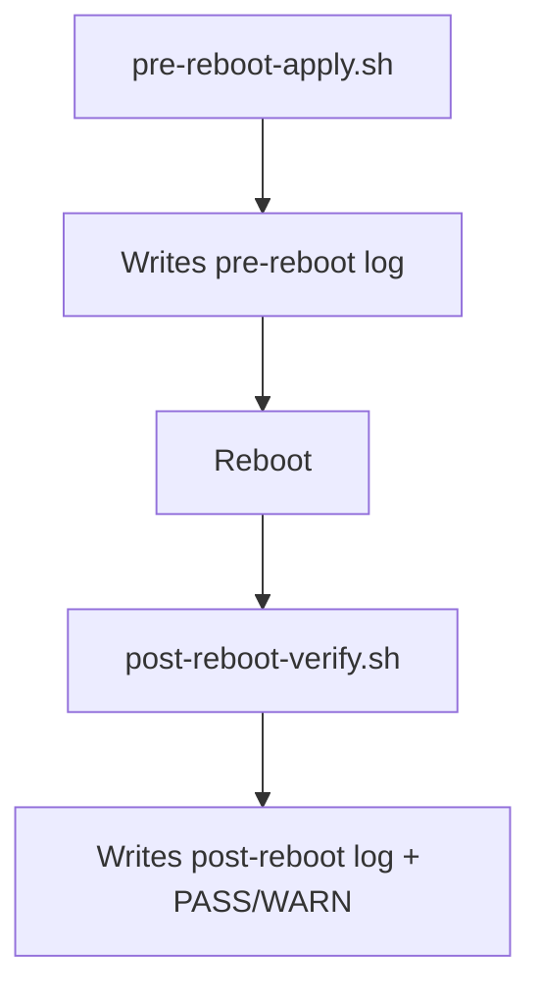

# NVIDIA + Hyprland Runbook

Use this when you want one clean apply/verify flow with persistent logs.

## 3 Commands Only

```bash
sudo ~/Documents/code/dotfiles/setup/pre-reboot-apply.sh
sudo reboot
~/Documents/code/dotfiles/setup/post-reboot-verify.sh
```

## Flow



## Log Locations

- `~/Documents/code/dotfiles/logs/pre-reboot-latest.log`
- `~/Documents/code/dotfiles/logs/post-reboot-latest.log`
- `~/.local/state/noxflow/waybar.log`

## What The Scripts Check

| Script | Purpose |
|---|---|
| `pre-reboot-apply.sh` | Normalizes boot args, sets default entry, ensures helper packages, snapshots current boot config |
| `post-reboot-verify.sh` | Verifies NVIDIA runtime, Vulkan/VA-API, Hypr plugin state, browser default, zsh keybinds, and boot hang signatures |
